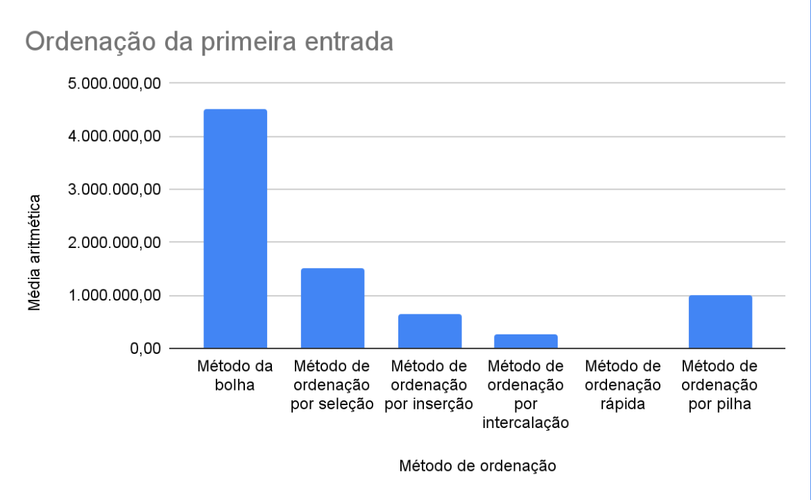
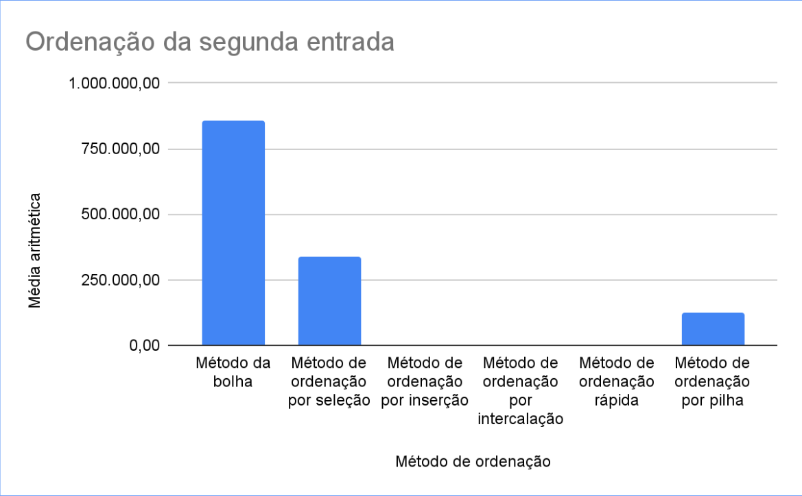
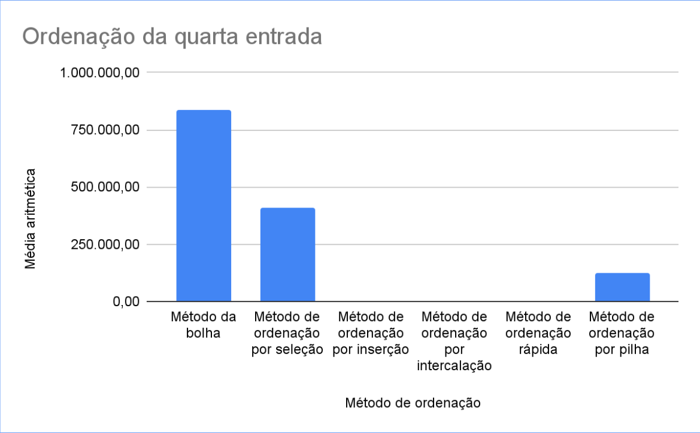

# sorting-algorithms-benchmark

## Sumário

- [sorting-algorithms-benchmark](#sorting-algorithms-benchmark)
  - [Sumário](#sumário)
  - [Motivação](#motivação)
  - [Time](#time)
  - [Pilha de tecnologia](#pilha-de-tecnologia)
  - [Galeria](#galeria)
  - [Como rodar](#como-rodar)
    - [Pré-requisitos](#pré-requisitos)
    - [Passo a passo](#passo-a-passo)

## Motivação

Este foi o primeiro repositório de código apresentado no [Curso Superior de TSI do IFMS](https://www.ifms.edu.br/campi/campus-aquidauana/cursos/graduacao/sistemas-para-internet/sistemas-para-internet) como requisito para obtenção da nota parcial de uma atividade da unidade curricular Estruturas de Dados, a qual consistiu em redigir um [relatório acadêmico](https://www.researchgate.net/publication/364317646_Mensuracao_de_desempenho_de_seis_metodos_de_ordenacao_utilizando_a_linguagem_de_programacao_TypeScript_Estudo_dos_tempos_de_execucao_dos_seguintes_metodos_de_ordenacao_metodo_da_bolha_metodo_de_ordena) sobre o estudo dos tempos de execução dos seguintes métodos de ordenação para [quatro vetores numéricos específicos](./src/data/):

- [Método da bolha ou _bubble sort_](./src/functions/bubbleSort.ts);
- [Método de ordenação por seleção ou _selection sort_](./src/functions/selectionSort.ts);
- [Método de ordenação por inserção ou _insertion sort_](./src/functions/insertionSort.ts);
- [Método de ordenação por intercalação ou _merge sort_](./src/functions/mergeSort.ts);
- [Método de ordenação por separação ou _quick sort_](./src/functions/quickSort.ts);
- [Método de ordenação por monte ou _heap sort_](./src/functions/heapSort.ts).

## Time

- [Ueslei Albuquerque Garcia](https://github.com/Ueslei86)
- [Murilo](https://github.com/MURILO17SILVA)
- Diego dos Santos Fernandes

## Pilha de tecnologia

As seguintes tecnologias foram utilizadas para desenvolver este app:

| Papel | Tecnologia |
|-|-|
| Ambiente de execução | [Node](https://nodejs.org/en/) |
| Linguagem de programação | [Javascript](https://developer.mozilla.org/pt-BR/docs/Web/JavaScript) |
| Plotagem de gráficos | [Google Spreadsheets](https://www.google.com/sheets/about/) |

## Galeria






## Como rodar

### Pré-requisitos

- [Node](https://nodejs.org/en/download/);
- [Yarn](https://yarnpkg.com/) (opcional).

### Passo a passo

1. Clone o repositório de código em sua máquina;
   
2. Abra um shell de comando de sua preferência (prompt de comando, PowerShell, Windows Terminal _etc_.);

3. Instale as dependências do projeto através do seguinte comando:

```console
$ npm install
```

Caso esteja utilizando o gerenciador de pacotes Yarn, execute o seguinte comando como alternativa:

```console
$ yarn
```

4. Finalmente, execute o seguinte comando para iniciar o app:

Para npm:

```console
$ npm run start
```

Para Yarn:

```console
$ yarn start
```

Note que você pode customizar o código-fonte [`index.js`](./index.js), adicionando ou modificando os métodos de ordenação, iterando mais ou menos vezes _etc_., além de modificar os arquivos de texto respectivos aos vetores no diretório [`data/`](./src/data/).